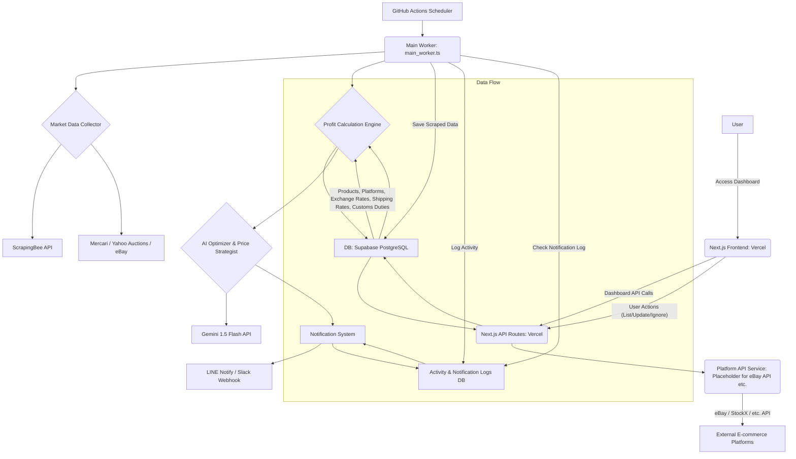

# 越境EC価格最適化エージェント 設計書

## 1. 概要 (Overview)

本設計書は、日本国内（メルカリ・ヤフオク・ラクマ・PayPayフリマ）と海外市場（eBay・Amazon・StockX・Mercari US）の価格差を利用した越境ECアービトラージを自動化し、利益最大化を目指す自律型エージェントのシステム設計を記述するものです。国内4 + 海外4 = **8プラットフォーム**に対応。最新のAI技術とAPIエコシステムを駆使し、市場調査、精密な利益計算、動的な価格最適化、および多言語リスティングの自動生成を行います。

### 1.1 目的 (Purpose)

*   越境ECにおける「自動価格最適化」と「利益最大化」の実現。
*   個人の運用者が1日1時間の作業で月商100万円以上を狙える自律型エージェントの構築。

### 1.2 目標 (Objectives)

*   国内・海外市場のリアルタイム価格情報収集。
*   リアルタイム為替、国際送料、関税、プラットフォーム手数料を考慮した正確な純利益算出。
*   高利益率商品の自動検出と通知。
*   競合価格に基づいた動的な販売価格最適化。
*   AIによる現地市場トレンドに合わせた魅力的な多言語商品説明文の自動生成。
*   システム全体の自律的な巡回・実行と堅牢な運用基盤の確立。

### 1.3 実装状況サマリ (Implementation Status)

本節では、**現時点で実装済みの範囲**と**設計のみで未実装の拡張**を明確に区別する。ユーザー・開発者が「できること」を誤解しないようにするためである。

#### 現状実装済み

| 領域 | 内容 | 備考 |
|------|------|------|
| 市場データ収集 | 国内4（メルカリ・ヤフオク・ラクマ・PayPayフリマ）+ 海外4（eBay・Amazon・StockX・Mercari US）= 8プラットフォーム対応。ScrapingBee API + cheerio スクレイピング + eBay Browse API + モックフォールバック | `mercariScraper.ts` / `yahooAuctionsScraper.ts` / `rakumaScraper.ts` / `paypayFleamarketScraper.ts` / `ebayScraper.ts` / `amazonScraper.ts` / `stockxScraper.ts` / `mercariUsScraper.ts` |
| 為替レート | DB テーブル `exchange_rates` の手動登録値を使用 | 外部為替API（Fixer 等）は未使用 |
| 国際送料 | DB テーブル `shipping_zones` / `shipping_rates` の登録値を使用 | Easyship 等の物流APIは未連携 |
| 利益計算 | `profitCalculator.ts` / `priceOptimization.ts` による着地コスト・最適価格算出 | 設計どおり |
| AI説明文生成 | Gemini 1.5 Flash API（`geminiService.ts`） | キー未設定時はモック文言を返却 |
| 通知 | LINE Notify / Slack Webhook（`notifierService.ts`）、重複防止・サマリーモード対応 | 設計どおり |
| ダッシュボード | Next.js App Router、商品一覧・ソート・タグ・メモ・CSVエクスポート・利益シミュレータ・分析トリガー・**分析用商品(SKU)選択**・**おすすめキーワード（国内・海外価格比較）**・初回案内（分析用商品0件時）・シミュレータ初期値（productSkus先頭）・分析完了待ちの案内・Supabase未設定時の再起動案内 | 出品/価格更新/無視ボタンはプレースホルダ |
| API | `/api/products`, `/api/products/[listingId]`, `/api/analyze` (POST+GET), `/api/simulate`, `/api/optimizeListing`, `/api/recommended-keywords`, `/api/product-skus` | 分析は POST で開始・GET で taskId 状態確認。分析時は `productSku` 指定で利益計算して保存 |
| ワーカー | `main_worker.ts`（CLI および API 経由のバックグラウンド実行） | GitHub Actions は ts-node で実行想定 |
| 監視・ログ | `activity_logs` / `notification_logs`、連続失敗時の緊急通知 | 失敗カウンタはインメモリ |

#### 将来拡張（設計のみ・未実装）

| 領域 | 内容 |
|------|------|
| 為替 | Fixer 等の外部APIでレート自動取得 |
| 物流 | Easyship 等のAPI連携 |
| スクレイピング | 全8プラットフォーム実装済み。各サイトのアンチボット対策強化（セレクタ更新等）が今後必要になる可能性あり |
| 出品・価格更新 | `platformApiService.ts` による eBay / StockX 等の実API連携（OAuth 含む） |
| ダッシュボード | 「eBayに出品」「価格を更新」「無視する」の実際のAPI呼び出し |
| その他 | 設計書 §11 の拡張項目（画像管理、AIタイトル最適化、注文・在庫連携、認証、エラーログ管理画面など） |

## 2. システムアーキテクチャ (System Architecture)

システムは、以下の主要コンポーネントで構成されるサーバーレスアーキテクチャを基本とします。

### 2.1 主要コンポーネント
*   **Next.js フロントエンド (Vercel)**: ユーザーインターフェース（管理ダッシュボード）。
*   **Next.js API Routes (Vercel)**: フロントエンドからの要求を処理するバックエンドAPI。AI最適化やプラットフォーム連携のトリガー。
*   **メインワーカー (`main_worker.ts`)**: システムの中核となる自律実行ロジック。
*   **Supabase (PostgreSQL DB)**: データの永続化層。商品メタデータ、市場価格、利益計算の基礎データ、各種ログなどを格納。`supabaseClient.ts` で環境変数未設定時も throw せず `isSupabaseConfigured()` で判定し、API は未設定時は JSON でエラーを返す。
*   **ScrapingBee API**: Webスクレイピングのプロキシ・CAPTCHA回避・IPローテーションを担う外部サービス。
*   **Gemini 1.5 Flash API**: AIによる商品説明文生成、トレンド分析に使用。（より安定した1.5 Flashを採用）
*   **LINE Notify / Slack Webhook**: 高利益商品発見時のユーザー通知に使用。
*   **GitHub Actions**: 定期実行スケジューラ。
*   **外部プラットフォーム（国内）**: メルカリ（10%）、ヤフオク（8.8%）、ラクマ（6.6%）、PayPayフリマ（5%）。※仕入れ時（買い手側）は手数料なし。
*   **外部プラットフォーム（海外）**: eBay（12.9%+$0.30/件固定）、Amazon（カテゴリ別8〜20%、デフォルト15%）、StockX（12%: 取引9%+決済3%）、Mercari US（10%）。

## 3. データベース設計 (Database Design)

SupabaseのPostgreSQLを想定し、以下のテーブルを定義します。各テーブルには`id` (UUID), `created_at`, `updated_at` カラムを共通で持ちます。

### 3.1 `products` テーブル

*   **目的**: 仲介対象商品の基本メタデータを格納。
*   **カラム**:
*   `id` (UUID, PK)
*   `sku` (VARCHAR, UNIQUE, NOT NULL): 商品SKU。
*   `name` (VARCHAR, NOT NULL): 商品名。
*   `description` (TEXT): 商品詳細説明。
*   `category` (VARCHAR): 商品カテゴリ。
*   `weight_kg` (DECIMAL(10,3)): 重量 (kg)。
*   `length_cm`, `width_cm`, `height_cm` (DECIMAL(10,3)): 寸法 (cm)。
*   `hs_code` (VARCHAR(20)): HSコード（関税計算用）。
*   `purchase_price` (DECIMAL(10,2)): 国内仕入価格 (JPY)。利益計算時、明示的な手入力価格 (`manualDomesticPrice`) が無い場合のデフォルトとして利用。

### 3.2 `platforms` テーブル

*   **目的**: E-commerceプラットフォーム情報と基本手数料を格納。
*   **カラム**:
    *   `id` (UUID, PK)
    *   `name` (VARCHAR, UNIQUE, NOT NULL): プラットフォーム名（例: 'Mercari', 'eBay'）。
    *   `base_fee_percentage` (DECIMAL(5,4), NOT NULL): 基本手数料率（例: eBay=0.1290）。
    *   `fixed_fee_local_currency` (DECIMAL(10,2), DEFAULT 0): 1取引あたり固定手数料（プラットフォーム通貨建て）。例: eBay=$0.30。
    *   `currency` (VARCHAR(3), NOT NULL): 主に使用される通貨コード（例: 'JPY', 'USD'）。

### 3.3 `exchange_rates` テーブル

*   **目的**: リアルタイム為替レートを格納。
*   **カラム**:
    *   `id` (UUID, PK)
    *   `from_currency` (VARCHAR(3), NOT NULL): 元通貨。
    *   `to_currency` (VARCHAR(3), NOT NULL): 先通貨。
    *   `rate` (DECIMAL(18,8), NOT NULL): 為替レート。
    *   `updated_at` (TIMESTAMP WITH TIME ZONE, NOT NULL): 最終更新日時。
    *   `UNIQUE (from_currency, to_currency)`

*   **レート取得フロー（`dbService.getExchangeRateLive`）**:
    1. `open.er-api.com`からリアルタイムレートを取得（無料・キー不要）
    2. 取得成功時はDBに自動保存（upsert）し、次回以降DBからも最新値が使える
    3. サーバーメモリで5分間キャッシュ（過剰APIコール防止）
    4. 取得失敗時はDBの前回値にフォールバック
    5. 対応通貨ペア: USD↔JPY（それ以外はDBのみ）
    *   この関数を `profitCalculator.ts`・`priceOptimization.ts` の全為替取得に使用し、シミュレーターや利益計算でも常に最新レートを反映する。

### 3.4 `shipping_zones` テーブル

*   **目的**: 国際送料計算のための配送ゾーンを定義。
*   **カラム**:
    *   `id` (UUID, PK)
    *   `name` (VARCHAR, UNIQUE, NOT NULL): ゾーン名（例: 'USA', 'Europe Zone 1'）。
    *   `description` (TEXT): ゾーンに含まれる国や地域の説明。

### 3.5 `shipping_rates` テーブル

*   **目的**: 重量・配送ゾーンごとの国際送料を格納。
*   **カラム**:
    *   `id` (UUID, PK)
    *   `shipping_zone_id` (UUID, NOT NULL, FK to `shipping_zones.id`)
    *   `min_weight_kg` (DECIMAL(10,3), NOT NULL): 最小重量。
    *   `max_weight_kg` (DECIMAL(10,3)): 最大重量（上限なしはNULL）。
    *   `cost_jpy` (DECIMAL(10,2), NOT NULL): 送料（JPY）。

### 3.6 `customs_duties` テーブル

*   **目的**: HSコードと国ごとの関税率を格納。
*   **カラム**:
    *   `id` (UUID, PK)
    *   `hs_code_prefix` (VARCHAR(20), NOT NULL): HSコードプレフィックス。
    *   `country_code` (VARCHAR(2), NOT NULL): ISO 3166-1 alpha-2 国コード。
    *   `duty_percentage` (DECIMAL(5,4), NOT NULL): 関税率。
    *   `min_value_usd`, `max_value_usd` (DECIMAL(10,2)): 課税対象価格範囲（USD）。
    *   `UNIQUE (hs_code_prefix, country_code)`

### 3.7 `market_prices` テーブル

*   **目的**: スクレイピングによって収集した市場価格情報を格納。
*   **カラム**:
    *   `id` (UUID, PK)
    *   `product_sku` (VARCHAR(255), FK to `products.sku`, NULLABLE): 内部商品SKUとの関連付け。
    *   `platform_id` (UUID, NOT NULL, FK to `platforms.id`)
    *   `listing_id` (VARCHAR(255), NOT NULL): プラットフォーム上の出品ID。
    *   `title` (VARCHAR(255), NOT NULL): 商品タイトル。
    *   `price` (DECIMAL(10,2), NOT NULL): 価格。
    *   `currency` (VARCHAR(3), NOT NULL): 価格の通貨。
    *   `condition` (VARCHAR(50)): 商品状態。
    *   `listing_url` (TEXT, NOT NULL): 出品ページのURL。
    *   `scraped_at` (TIMESTAMP WITH TIME ZONE, NOT NULL): スクレイピング日時。
    *   `image_url` (TEXT): 商品画像URL。ダッシュボードでのサムネイル表示用。
    *   `optimized_english_description` (TEXT): AIが生成した英語の商品説明文。
    *   `optimal_price` (DECIMAL(10,2)): 海外プラットフォーム通貨での最適販売価格。
    *   `strategy` (VARCHAR(100)): 価格決定に用いた戦略（例: 'UndercutLowestCompetitor', 'MaintainMinProfit'）。
    *   `profit_details` (JSONB): 利益計算の詳細（`CalculatedProfitDetails` 相当）。
    *   `profit_margin` (DECIMAL(5,4)): 利益率（純利益 ÷ 売上）。
    *   `data_source` (VARCHAR(20), DEFAULT 'scraped'): データソース種別（`'scraped'` または `'mock'`）。
    *   `search_keyword` (VARCHAR(255)): 分析時に指定した検索キーワード。おすすめ表示・履歴用。
    *   `UNIQUE (platform_id, listing_id)`

### 3.8 `activity_logs` テーブル

*   **目的**: `main_worker`の実行ログ（成功/失敗/スキップ）を記録。運用保守、トラブルシューティング用。
*   **カラム**:
    *   `id` (UUID, PK)
    *   `timestamp` (TIMESTAMP WITH TIME ZONE, NOT NULL): ログ記録日時。
    *   `workflow_name` (VARCHAR(255), NOT NULL): ワークフロー名（例: 'main_product_scan'）。
    *   `status` (VARCHAR(50), NOT NULL): 実行ステータス（'started', 'finished', 'success', 'failure', 'skipped', 'emergency'）。
    *   `message` (TEXT): 詳細メッセージ。
    *   `product_sku` (VARCHAR(255)): 関連する商品SKU（あれば）。
    *   `details` (JSONB): 追加の詳細データ（エラー情報など）。

### 3.9 `notification_logs` テーブル

*   **目的**: ユーザーへ送信した通知の履歴を記録。重複通知防止ロジックに使用。
*   **カラム**:
    *   `id` (UUID, PK)
    *   `timestamp` (TIMESTAMP WITH TIME ZONE, NOT NULL): 通知送信日時。
    *   `product_sku` (VARCHAR(255), NOT NULL, FK to `products.sku`)
    *   `platform` (VARCHAR(50), NOT NULL): 通知対象プラットフォーム（例: 'eBay'）。
    *   `notified_price` (DECIMAL(10,2), NOT NULL): 通知時の販売価格。
    *   `notified_profit_margin` (DECIMAL(5,4), NOT NULL): 通知時の利益率。
    *   `notification_method` (VARCHAR(50), NOT NULL): 通知方法（'LINE', 'Slack' など）。
    *   `message` (TEXT, NOT NULL): 送信された通知メッセージ。
    *   `dashboard_link` (TEXT): ダッシュボードへのリンク。

    ※ 重複通知防止はDBのUNIQUE制約ではなく、アプリケーションロジック側で「直近24時間以内に同じ `product_sku`・`platform` への通知が存在する場合はスキップ」するクールダウン方式で実現する。

## 4. コアロジック: 利益計算エンジン (Profit Calculation Engine)

### 4.1 概要
商品ごと・販売プラットフォームごとに正確な「着地コスト（Landed Cost）」を算出し、最終的な純利益を1円単位で計算します。

### 4.2 計算式
`利益 = (海外販売価格 × 為替) − (国内仕入価格 + 国際送料 + 関税 + 海外プラットフォーム手数料)`

**手数料の詳細:**
- 国内プラットフォーム手数料: **0円**（仕入れ時は買い手のため手数料なし。仕入価格に出品者の手数料が反映済み）
- 海外プラットフォーム手数料: `売価 × 料率 + 固定手数料`
  - eBay: 12.9% + $0.30/件（Managed Payments準拠）
  - StockX: 12%（取引手数料9% + 決済手数料3%）
  - Amazon: カテゴリ依存（電子8%, アパレル17%, ジュエリー20%, デフォルト15%）
  - Mercari US: 10%
- 関税: HSコードと仕向け国・申告価格（海外販売価格）に基づきDBから取得。US向けde minimis（$800以下免税）対応。

**おすすめキーワードAPIの簡易試算:**
`簡易利益 = 海外売上(JPY) − 海外手数料 − 国内仕入価格 − 送料概算(¥3,500) − 関税概算($800超の場合5%)`
※関税概算・送料固定のため、分析実行後の確定利益と差異が生じることがある。実際の純利益は分析実行後の一覧で確認すること。

※最新の算出結果には、上記すべての項目を網羅した「利益内訳（Profit Details）」が含まれ、フロントエンドで透明性を確保する。

### 4.3 入力 (Input)
*   `productSku`: 商品SKU
*   `domesticPlatform`: 国内仕入プラットフォーム
*   `overseasPlatform`: 海外販売プラットフォーム
*   `destinationCountryCode`: 配送先国コード
*   `targetSellingPriceOverseas` (**必須**): 目標販売価格（海外通貨）。現行実装では外部価格APIフォールバックは未実装のため必須入力。
*   `manualDomesticPrice` (Optional): 手入力の国内仕入価格 (JPY)。指定が無い場合は `products.purchase_price` を利用。

### 4.4 処理フロー
1.  `productSku`から`products`テーブルより商品メタデータ（重量、HSコード、`purchase_price` など）を取得。
2.  国内仕入価格を決定:
    *  `manualDomesticPrice` が指定されていればそれを優先。
    *  指定が無い場合は `products.purchase_price` を利用（いずれも未設定の場合はエラー）。
3.  `targetSellingPriceOverseas` を海外販売価格として採用（現行実装では外部APIフォールバックは未実装のため必須）。
4.  `overseasPlatform`の通貨とJPY間の為替レートを取得（`dbService.getExchangeRate`）。
5.  商品重量と`destinationCountryCode`に基づき国際送料を取得（`dbService.getShippingCost`）。
6.  HSコード、`destinationCountryCode`、販売価格（USD換算）に基づき関税率を取得（`dbService.getCustomsDuty`）し、関税額を算出。
7.  国内・海外プラットフォームの手数料率を取得（`dbService.getPlatform`）し、各手数料を算出。
8.  上記の計算式に従って純利益を算出。

### 4.5 エラーハンドリング
*   APIからの価格取得失敗。
*   DBからのメタデータ取得失敗。
*   為替レートの取得失敗、または異常値の検出。
*   不足データ（重量、HSコードなど）による計算不能。

## 5. 市場データ収集機能 (Market Data Collection)

### 5.1 概要
指定されたキーワードに基づき、国内（メルカリ・ヤフオク）および海外（eBay）のE-commerceサイトから価格、タイトル、URL等の情報をスクレイピング・収集します。ScrapingBeeなどのプロキシAPIを介して、スクレイピング対策を回避します。

### 5.2 コンポーネント
*   **`scrapingbeeService.ts`**:
    *   ScrapingBee APIを呼び出し、URLからHTMLコンテンツを安全に取得する汎用Fetcherクラス。
    *   プロキシ利用、CAPTCHA回避、IPローテーションをScrapingBee側に委ねる。
    *   JavaScriptレンダリングや特定の国コード指定に対応。
*   **`mercariSelectors.ts`**:
    *   Mercariの検索結果ページから商品タイトル、価格、URLなどを抽出するためのCSSセレクタを定数として定義。サイト仕様変更時の保守性を考慮。
*   **`mercariParser.ts`**:
    *   ScrapingBeeから取得したMercariのHTMLコンテンツを解析し、構造化された`MarketPriceItem`オブジェクトの配列としてデータを抽出。`cheerio`ライブラリを使用。
*   **`mercariScraper.ts`**:
    *   `scrapingbeeService`と`mercariParser`を連携させ、特定のキーワードでMercariをスクレイピングする高レベルな関数。
*   **`ebayScraper.ts`**:
    *   ScrapingBee経由でeBay検索結果ページを取得し、`parseEbaySearchPrices` で `.s-item__price` をパース。`fetchEbayPricesForKeyword(keyword)` がおすすめキーワードAPIで利用。取得失敗時は `generateMockEbayPrices(keyword)` でモックUSD価格を返し、APIは継続して結果を返す（その場合は `fromPriceCheck: false` になり参考表示となる）。
*   **(将来的な拡張)** `yahooAuctionScraper.ts` など、サイトごとのScraper/Parserモジュール。

### 5.3 データ保存
収集した市場データは、`main_worker` 内で `dbService.upsertMarketPrice` により `market_prices` テーブルに Upsert される。競合キーは `(platform_id, listing_id)`。SKU 指定時は `product_sku`, `optimized_english_description`, `optimal_price`, `strategy`, `profit_details`, `profit_margin` も保存され、未指定時は `product_sku` を null とし `search_keyword` に分析キーワードを記録する。型は `types.ts` の `MarketPriceDbRecord`（`search_keyword` 含む）。

## 6. AIコンテンツ生成 兼 価格最適化エンジン (AI Content Generation & Price Optimization)

### 6.1 概要
収集した市場データと利益計算ロジックを活用し、AIによる多言語商品説明文のリライトと、競合価格・利益目標に基づいた最適な販売価格の算出を行います。

### 6.2 AIリライト・プロンプト実装 (`geminiService.ts`)
*   **Gemini 1.5 Flash API**と連携（将来的に 2.0 へのアップグレードを想定）。
*   **`generateEnglishDescription`関数**: 日本語の商品タイトル・説明文・カテゴリを入力とし、ターゲット国のトレンドやコレクター層に響く魅力的な英文の説明文を生成。
*   **プロンプトテンプレート**: カテゴリごとに微調整可能なプロンプト構造を持ち、単なる翻訳ではなく、マーケティング的視点（キーワード、希少性、文化的意義など）を重視。

### 6.3 価格最適化ロジック実装 (`priceOptimization.ts`)
*   **`determineOptimalSellingPrice`関数**:
    1.  **最低競合価格の検出**: 競合商品のリストから、目標通貨における最低価格を特定。
    2.  **最低利益ラインの算出**: `calculateMinSellingPrice`関数を通じて、指定された最低利益率を確保するために必要な販売価格（海外通貨）を算出。
        *   **精密逆算アルゴリズム**: 販売価格に比例するコスト（eBay販売手数料約13%前後、推定関税等）を考慮し、代数的に解を求めることで、手数料引き後でも確実に目標利益を確保できる価格を算出する。  
            現行実装では、関税率の推定において循環依存を避けるため、販売価格そのものではなく「国内仕入価格（JPY）をUSD換算した値」を近似的な評価額として用いている。
    3.  **最適価格決定ロジック**:
        *   競合の最安値より1円（または1セント）安くする（`lowestCompetitorPrice - 0.01`）。
        *   ただし、この価格が最低利益ラインを下回る場合、利益を優先して最低利益ラインの価格を維持する（`minSellingPriceLocalCurrency`）。
        *   競合がいない場合は、最低利益ラインの価格をそのまま採用。

### 6.4 APIエンドポイント (`app/api/optimizeListing/route.ts`)
*   **HTTP POST**で以下の情報を受け取る:
    *   `productSku`, `productTitleJP`, `productDescriptionJP`, `productCategory`
    *   `currentCompetitorPrices` (競合価格の配列)
    *   `targetOverseasPlatform`, `destinationCountryCode`, `minProfitMarginPercentage`
*   **処理フロー**:
    1.  `geminiService.generateEnglishDescription`を呼び出し、AI商品説明文を取得。
    2.  `priceOptimization.determineOptimalSellingPrice`を呼び出し、最適販売価格と戦略を取得。
    3.  得られた最適価格を海外通貨建ておよびJPY換算で保持しつつ、`OptimizeListingOutput`（最適価格、AI説明文、利益計算詳細など）をJSON形式で返却。

### 6.5 利益シミュレーションAPI (`app/api/simulate/route.ts`)
*   **目的**: 実際のスクレイピングを行わずに、SKUと想定売価から利益計算だけを試す「クイック電卓」機能を提供する。
*   **HTTP POST**で以下の情報を受け取る:
    *   `productSku` (必須): シミュレーション対象のSKU。
    *   `domesticPlatform` (必須): `'Mercari'` または `'Yahoo Auctions'`。
    *   `overseasPlatform` (必須): `'eBay'` または `'StockX'`。
    *   `destinationCountryCode` (必須): 配送先国コード（例: 'US'）。
    *   `targetSellingPriceOverseas` (必須): 想定販売価格（海外通貨、現状USD想定）。
    *   `manualDomesticPrice` (任意): 手入力の国内仕入れ価格 (JPY)。未指定の場合はDB上の `purchase_price` を利用。
*   **処理フロー**:
    1.  入力値のバリデーション（必須項目・数値妥当性）。
    2.  `calculateProfit` を呼び出し、着地コストと純利益を計算。
    3.  `CalculatedProfitDetails` をJSONとして返却。エラー時は `ProfitCalculationError` をユーザ向け日本語メッセージに変換して返却。

## 7. エージェント管理ダッシュボード (Agent Management Dashboard)

### 7.1 概要
ユーザーがエージェントの発見した高利益商品や提案された価格・説明文を一目で確認し、必要なアクションを承認・実行するためのNext.jsベースのモダンなUIを提供します。

### 7.2 技術スタック
*   **Next.js (App Router)**
*   **TypeScript**
*   **Tailwind CSS**: クリーンでモダンなUIデザイン。
*   **shadcn/ui** (利用を想定): コンポーネントライブラリとして採用可能。

### 7.3 商品リスティング一覧画面 (`app/dashboard/page.tsx`)
*   **UI形式**: レスポンシブなカード型UI（またはテーブル）。
*   **表示項目**:
    *   商品画像 (Placeholder)
    *   国内仕入価格 (JPY) vs 海外想定販売価格 (目標通貨)
    *   推定純利益 (JPY): プラス/マイナスの記号付きで色分け表示。
    *   利益率 (パーセンテージ): 目標達成度合いをプログレスバーで表示。
    *   **利益内訳 (Breakdown)**: 「内訳を表示」ボタンによる折りたたみ式明細表示。
        *   仕入原価、国際送料、eBay/メルカリ手数料、為替レート、推定関税。
    *   AIが生成した英語の商品説明文（プレビュー表示、`line-clamp-3`で省略）。
    *   データの最終更新日時 (Last Synced)。
    *   ユーザ付与タグ（`有望` / `保留` / `仕入れ済み` / タグなし）。
    *   ユーザメモ（仕入れメモ・在庫場所・注意点など）。ブラウザローカルに保存。

*   **ソート・フィルタ機能**:
    *   ソートキー:
        *   最新順
        *   利益額が高い順
        *   利益率が高い順
        *   仕入れ価格が安い順
    *   タグフィルタ:
        *   すべて / 有望 / 保留 / 仕入れ済み / タグなし

*   **バックエンド連携**:
    *   `/api/products` (GET): `market_prices` を全件取得し、snake_case を camelCase にマッピングして返す。Supabase 未設定時は 503 と JSON エラー。
    *   `/api/products/[listingId]` (GET): `listing_id` で単一レコードを取得。詳細表示用。
    *   `/api/analyze` (POST): 本文に `keyword` (必須), `productSku` (任意)。バックグラウンドで `mainWorkflow([keyword], 0.10, productSku)` を実行し、即座に `{ success, message, taskId }` を返す。タスク状態はメモリ上の `taskStatus` に保持（上限50件、古いものから削除）。
    *   `/api/analyze` (GET): クエリ `taskId` でタスク状態を返す。ダッシュボードは分析開始後に 3 秒間隔でポーリングして完了を検知する。
    *   `/api/recommended-keywords` (GET): 候補キーワード（`CANDIDATE_KEYWORDS`、最大6件をチェック）に対しメルカリ・eBay の価格を取得。商品単位で簡易利益（eBay中央値×為替×0.87 − メルカリ価格 − 送料3,500円）が1,100円以上となるものを抽出。キーワードは「利益が出る商品が1件以上あるキーワード」、商品は利益額順でキーワードあたり最大3件・全体最大15件。10分間キャッシュ。返却: `keywords`, `products`（`keyword`, `title`, `mercariPrice`, `ebayPriceUsd`, `estimatedProfitJpy`, `profitMarginPercent`, `imageUrl`, `mercariUrl`, `ebaySearchUrl`）, `fromPriceCheck`（価格比較で選定したか／0件時やeBay失敗時は false で候補を参考表示）。
    *   `/api/product-skus` (GET): 分析時に紐づけ可能な商品一覧。`products` テーブルから `sku`, `name` を取得。Supabase 未設定時は `{ success: true, items: [] }`。
    *   `/api/simulate` (POST): 上記 6.5 の利益シミュレーションAPI。ダッシュボード上部の「クイック利益シミュレータ」から呼び出し。
*   **分析用商品(SKU)選択**:
    *   検索バー横に「分析用商品」ドロップダウンを配置。`/api/product-skus` で取得した商品から選択可能。「指定しない」のまま分析すると利益が計算されず一覧に0件となるため、一覧に商品を表示するにはSKUを選んでからおすすめキーワードまたは検索で分析を実行する。UI上にその旨の説明文を表示。
    *   **分析用商品が0件のとき**: アンバーバナーで「schema.sql のシードでサンプルを投入するか、products テーブルに商品を登録してください」を表示。
*   **シミュレータの初期SKU**: `productSkus` が取得できた場合、先頭の SKU を初期値に設定。ユーザーが手動で選んだ SKU が一覧にあればそのまま維持。
*   **おすすめの簡易試算注釈**: おすすめ商品パネルの推定利益に「（簡易・関税等未考慮）」を常時表示。セクション上部に「※おすすめの推定利益は簡易試算です（関税・手数料の一部未考慮）。実際の純利益は分析実行後の一覧で確認してください。」を表示。
*   **分析完了待ちの案内**: 分析開始中（analyzing かつ error なし）のとき、「分析を開始しました。完了まで1〜3分かかることがあります。完了したら一覧を自動で更新します。」をインディゴバナーで表示。
*   **エラーメッセージ**: `translateErrorMessage` で送料・関税・国内仕入価格などの日本語メッセージに変換。Supabase 未設定時は「設定後は、ターミナルで Ctrl+C でサーバーを停止し、再度 npm run dev を実行してください。」を追加表示。`fetch failed` 検出時は Supabase 無料プランの7日間自動停止を案内し「Restore project」の操作手順を表示。

### 7.4 分析モードと動的フィルタリング
ユーザーの投資スタイルに応じた「分析モード」選択機能を搭載。
*   **手軽にコツコツ (Casual)**: 利益1,100円（最低時給目安）以上の商品を表示。回転率の高い商材を優先。
*   **一撃重視プロ (Professional)**: 純利益3,000円以上の高利益商品のみを厳選して表示。
*   **動的おすすめキーワード**: `GET /api/recommended-keywords` で取得。候補キーワードごとにメルカリ・eBayの価格を取得し、簡易利益（海外売上×0.87 − メルカリ最安 − 送料3,500円）が1,100円以上となるキーワードのみをおすすめとして表示。0件時は候補を「参考表示」し、ScrapingBee未設定時はeBayが取れないため参考表示となる。選択した分析モード（利益1,100円以上／3,000円以上）は一覧のフィルタにのみ適用され、おすすめの選定基準は上記の簡易利益1,100円以上で固定。
*   **おすすめ商品パネル**: API が返す `products` 配列（利益が出る個別商品：キーワード・タイトル・メルカリ価格・eBay価格・推定利益・画像・URL）を表示。クリックでそのキーワードで分析を実行できる。
*   **即売れ候補AI判定**: `GET /api/recommended-keywords` のレスポンスに含まれる `demandScore`・`isInstantSellCandidate`・`demandCategory`・`demandReasoning` フィールドを利用してUIに反映する。GeminiAIが商品タイトルをバッチ解析し（最大20件/回）、海外コレクター需要スコア（0〜10）を付与。スコア7以上を「即売れ候補」と判定する。
    *   **キーワードプリフィルタ**: フィルムカメラ・レトロゲーム・ウォークマン・ヴィンテージオーディオ等の需要カテゴリ関連キーワードを含む商品だけをAI分析対象とし、無関係な商品への無駄なAPI消費を防ぐ。
    *   **ランキング再整列**: AI分析後、即売れ候補（`isInstantSellCandidate=true`）を上位グループに昇格させ、グループ内は `profit + score×500JPY` の複合スコアで並べる。
    *   **UIバッジ**: 即売れ候補カードの画像オーバーレイに `🔥 即売れ候補` バッジとカテゴリラベルを表示。カード枠をオレンジ（`border-orange-500/30`）でハイライト。
    *   **需要スコア行**: カード本体に `★★★★☆ 8/10` 形式のスター表示とスコア数値を表示。AI生成の理由文（最大60文字）をツールチップで参照可能。
    *   **トグルボタン**: セクションヘッダーに「🔥 即売れ候補のみ」ボタンを配置。ON時は `isInstantSellCandidate=true` の商品のみ表示。検出件数を丸バッジで表示。
    *   **フォールバック**: `GEMINI_API_KEY` 未設定・API失敗時はスコア0・`isInstantSellCandidate=false` で全件フォールバックし、UIへの影響なし（バッジ・スコア非表示）。
*   **分析タスクの状態**: 分析開始後、`GET /api/analyze?taskId=...` を 3 秒間隔でポーリングし、`running` / `completed` / `failed` を検知してUIを更新。
*   **フィルタリング・フィードバック**: 指定した利益基準に満たない商品が何件存在するかをユーザーに明示し、必要に応じて設定した基準の緩和（モード切替）をボタン一つで実行できるUIを提供。

### 7.5 アクション・ボタン
各商品カードに以下のボタンを配置。
*   **「eBayに出品」**: `handleListOnPlatform`関数を呼び出し、`platformApiService.listProductOnPlatform`を介して商品を出品する（将来的）。
*   **「価格を更新する」**: `handleUpdatePrice`関数を呼び出し、`platformApiService.updateListingPriceOnPlatform`を介して既存出品の価格を更新する（将来的）。
*   **「無視する」**: `handleIgnore`関数を呼び出し、その商品を無視対象としてDBにフラグを立てる（将来的）。
*   **現状の実装**: 実際のeBay API連携は未実装であり、フロント側のボタンは「メルカリ商品ページ」「eBay検索結果ページ」へのリンクを提供する形で市場調査を支援する。将来的に`platformApiService.ts`経由でAPI連携を行うことを想定。
*   **出品テンプレート表示**: 各商品カードには「eBay出品用テンプレートを表示」ボタンがあり、クリックでタイトル・価格・英語説明文・簡易ノートを含むテキストテンプレートを展開表示し、eBay出品画面にコピペできるようにする。

### 7.6 CSVエクスポート機能
*   ダッシュボードで現在表示中のフィルタ済み商品一覧をCSVとしてダウンロード可能。
*   出力カラム例:
    *   `SKU`, `Title`, `Category`, `DomesticPriceJPY`, `OverseasPrice`, `Currency`, `EstimatedProfitJPY`, `ProfitMargin`, `Tag`, `ListingUrl`, `EbaySearchUrl`, `LastSynced`。

### 7.7 クイック利益シミュレータ
*   ダッシュボード上部に、簡易なフォームを配置:
    *   `SKU`, `国内プラットフォーム`, `海外プラットフォーム`, `配送先国コード`, `目標販売価格 (USD)`, `国内仕入価格 (JPY, 任意)`。
*   送信時に `/api/simulate` を呼び出し、結果として:
    *   売上(USD/JPY換算)、仕入原価、国際送料、国内・海外手数料、関税を含む**コスト内訳**
    *   推定純利益とその利益率の目安
  を1画面で表示し、ユーザーが「この価格で出して意味があるか」をすぐ判断できる。

### 7.5 利益率フィルタリング機能
*   ダッシュボード上部にフィルタUIのプレースホルダーを配置。
*   「利益率20%以上の商品のみ表示」など、利益率で商品を絞り込む機能の実装を想定。

## 8. 自律通知システムと全体連携 (Autonomous Operations & Integration)

### 8.1 概要
システム全体の自律的な巡回・実行を可能にし、高利益機会の発見時に即座にユーザーへ通知。ダッシュボードからのアクションをリアルタイムにプラットフォームへ反映する仕組みを構築。堅牢なエラーハンドリングと運用ログも整備。

### 8.2 通知システム (`notifierService.ts`)
*   **`Notifier`クラス**:
    *   LINE Notify または Slack Webhook を利用してメッセージを送信。
    *   高利益率商品（例: 20%以上）が見つかった際に、商品名、推定利益、利益率、ダッシュボードへのリンクを含む通知を自動送信。
    *   環境変数からAPIトークン/Webhook URLを読み込み。
*   **重複通知防止ロジック**:
    *   `notification_logs`テーブルを参照し、「直近24時間以内に同一 `product_sku` と `platform` の通知履歴が存在する場合はスキップ」するクールダウン方式を採用。
*   **通知しきい値・モード設定**:
    *   環境変数により以下を制御可能:
        *   `MIN_PROFIT_MARGIN_FOR_NOTIFICATION`: 通知対象とする最低利益率（デフォルト 0.20 = 20%）。
        *   `MIN_PROFIT_AMOUNT_FOR_NOTIFICATION_JPY`: 通知対象とする最低利益額（デフォルト 0 円 = 制限なし）。
        *   `MAX_NOTIFICATIONS_PER_RUN`: 1回のワークフロー実行あたりの最大通知件数（デフォルト無制限）。
        *   `NOTIFICATION_MODE`: `'immediate'`（従来どおり即時通知）または `'summary'`（上位N件のみをまとめて通知）。
        *   `SUMMARY_TOP_N`: サマリーモード時に通知する上位件数（デフォルト 3）。

### 8.3 全モジュールの統合 (`main_worker.ts`)
*   **メインワークフロー**: `mainWorkflow(keywords: string[], defaultMinProfitMargin?: number, productSku?: string, keywordSkuMap?: Record<string, string>)`。API の `/api/analyze` からは `mainWorkflow([keyword], 0.10, productSku)` で呼び出される。キーワードごとのSKUは `keywordSkuMap?.[keyword] ?? productSku ?? null` で決定。
*   **処理順序**:
    1.  **開始ログ**: `activity_logs` に「Workflow started」を記録。
    2.  **市場データ収集**: キーワードごとに `scrapeMercari(keyword)` でメルカリをスクレイピング（eBay のスクレイピングは本ワークフローでは行わず、おすすめキーワードAPI側で利用）。
    3.  **SKUの有無**: `skuForKeyword` が null または該当商品がDBにない場合は、市場価格のみを `market_prices` に保存（`search_keyword` にキーワードを記録）してスキップ。SKU がある場合のみ次へ。
    4.  **利益計算と最適化**: `getCompetitorPrices(sku, 'eBay')` で競合価格を取得し、`generateEnglishDescription` と `determineOptimalSellingPrice` を呼び出し。結果を `market_prices` に Upsert（`search_keyword` 含む）。
    5.  **通知**: 利益率・利益額が閾値を超え、かつ直近24時間に同一 SKU・プラットフォームの通知がなければ `notifierService` で送信し、`notification_logs` に記録。`NOTIFICATION_MODE` が `summary` の場合は上位 N 件をまとめて通知。
    6.  **終了ログ**: `activity_logs` に「Workflow finished」を記録。

### 8.4 監視と自動リカバリ (`main_worker.ts`内)
*   **実行ログ**: 各ステップの成功、失敗、スキップ理由を`activity_logs`テーブルに詳細に記録。
*   **連続失敗カウンター**: ワークフローが連続で失敗した回数を記録（モックとしてインメモリ`FAILURE_TRACKING_TABLE`）。
*   **緊急通知**: 連続失敗回数が`MAX_CONSECUTIVE_FAILURES`（例: 3回）を超えた場合、緊急通知を管理者に送信。
*   **カウンターリセット**: ワークフローが正常終了した場合、連続失敗カウンターをリセット。

### 8.5 リアルタイム反映（将来拡張インターフェース） (`platformApiService.ts`)
*   **`platformApiService.ts`**: eBayなどの外部プラットフォームAPIと連携するためのプレースホルダー関数群。
*   **関数**:
    *   `listProductOnPlatform`: 商品を新規出品。
    *   `updateListingPriceOnPlatform`: 既存出品の価格を更新。
    *   `endListingOnPlatform`: 出品を停止。
*   **役割**: ダッシュボードのボタンアクション (`handleListOnPlatform`, `handleUpdatePrice`) から呼び出されるAPIルート（Next.js API Route）が、このサービスを介して実際のプラットフォーム操作を行うことを想定。

## 9. 技術スタック (Tech Stack)

*   **Frontend**: Next.js (App Router), TypeScript, React, Tailwind CSS, shadcn/ui (想定)
*   **Backend**: Next.js (API Routes), TypeScript
*   **Database**: Supabase (PostgreSQL)
*   **AI Model**: Gemini 1.5 Flash（将来的に 2.0 へのアップグレードを想定）
*   **Scraping API**: ScrapingBee
*   **Currency Exchange API**: Fixer (想定)
*   **Logistics API**: Easyship (将来的に統合)
*   **External Platforms**: メルカリ、ヤフオク、eBay、StockX (ターゲット)
*   **Scheduling/CI/CD**: GitHub Actions
*   **Deployment**: Vercel
*   **Notification**: LINE Notify, Slack Webhook
*   **HTML Parsing**: Cheerio

## 10. デプロイメント戦略 (Deployment Strategy)

### 10.1 CI/CDパイプライン
*   **GitHub**: ソースコード管理。
*   **GitHub Actions**:
    *   `main_worker.ts`の1時間ごとの定期実行 (`cron: '0 * * * *'`)。
    *   `workflow_dispatch`による手動実行を可能にする。
    *   Node.js環境セットアップ、依存関係インストール、TypeScriptコンパイル。
    *   Vercelへの自動デプロイメント（VercelのGitHub連携で自動設定される）。
*   **Vercel**: Next.jsアプリケーション（フロントエンドおよびAPI Routes）のサーバーレスデプロイ。

### 10.2 環境変数の管理
*   **GitHub Secrets**: GitHub Actionsのワークフローで使用する全てのAPIキー、トークンなどをセキュアに管理。
*   **Vercel Environment Variables**: VercelにデプロイされたNext.jsアプリケーションが使用する全てのAPIキー、トークンなどをセキュアに管理。`NEXT_PUBLIC_`プレフィックスの有無でクライアント/サーバーサイドのアクセスを制御。

### 10.3 運用コスト最適化 (無料枠の活用)
*   **GitHub Actions**: 2000分/月の無料枠内で収まるよう、 hourly (1時間ごと) 実行から開始。必要に応じて実行頻度を調整 (`0 */3 * * *` など)。
*   **Vercel**: Hobbyプラン (無料枠) での運用を想定。ビルド時間、サーバーレス関数の実行回数を監視。
*   **Supabase**: Freeプランでの運用を想定。データベースサイズ、ストレージ、APIコール回数を監視し、最適化。
*   **外部API**: 各APIの無料枠を最大限活用し、不要なリクエストを削減（例: 為替レートのキャッシュ、スクレイピング対象の絞り込み）。

## 11. ユーザー展開前チェックリスト (Pre-launch Checklist)

### 実装済み ✅
- **認証**: `middleware.ts` による HTTP Basic 認証（`DASHBOARD_PASSWORD` 環境変数で設定）
- **セキュリティヘッダー**: `next.config.js` で X-Frame-Options・HSTS・nosniff 等を設定
- **Supabase キー保護**: `SUPABASE_SERVICE_ROLE_KEY`（サーバー専用）対応。`NEXT_PUBLIC_` 変数を非推奨化
- **RLS（Row Level Security）**: schema.sql に有効化・ポリシー設定を追加（Supabase SQL Editorで手動実行）
- 為替レートのリアルタイム取得（open.er-api.com、5分キャッシュ、DB自動更新）
- 利益計算エンジン（手数料・関税・送料・為替を正確に反映）
- eBay固定手数料$0.30対応
- StockX手数料12%（取引9%+決済3%）対応
- Amazon カテゴリ別手数料対応（電子8%/アパレル17%など）
- US de minimis $800以下免税対応
- おすすめAPIの簡易試算に関税概算・eBay固定手数料を反映
- Supabase連携・リアルタイム為替レート取得（open.er-api.com）
- ダッシュボード：ソート・フィルタ・CSV・シミュレータ・通知

### 未実装（ユーザー展開時のリスク） ⚠️

| 優先度 | 項目 | 影響 |
|--------|------|------|
| 高 | **認証機能なし** | URLを知ると誰でもアクセス可能 |
| 高 | **商品登録UI なし** | SQLでしか商品を追加できない |
| 高 | **GitHub Actions Secrets 未設定** | 定期実行ワーカーが動かない |
| 中 | **eBay/出品ボタンが非機能** | 「eBayに出品」はリンクのみ |
| 低 | **送料がDB固定値** | 実際の日本郵便/EMS料金と乖離する可能性 |
| 低 | **GeminiキーなしでAI説明文がモック** | 英語説明文が自動生成されない |

### 今後の拡張 (Future Considerations / Expansion Points)

*   **多サイト対応**: Yahoo Auctions, StockX, その他海外プラットフォームのScraper/Parserの実装。
*   **商品画像管理**: 商品画像の取得、S3などのストレージへの保存、ダッシュボードへの表示。
*   **出品APIの本格連携**: eBay等のリアルAPI（OAuth認証含む）と`platformApiService.ts`の完全な統合。
*   **AIによるタイトル最適化**: 英語商品説明文だけでなく、商品タイトルもAIで最適化。
*   **出品停止ロジック**: 利益率が一定値を下回った場合の自動出品停止機能。
*   **価格追従機能の強化**: 競合価格のリアルタイム監視と、より高度な価格改定戦略（例: 競合が多すぎる場合の価格維持、価格帯ごとの最適化）。
*   **注文・在庫管理連携**: 実際の注文情報や在庫データとの連携。
*   **ユーザー認証・管理**: 複数のユーザーでの利用を想定した認証機能。
*   **エラーログ管理画面**: `activity_logs`や`notification_logs`をGUIで確認できる管理画面の構築。
*   **テスト**: 各モジュールに対するユニットテスト、統合テストの追加。
